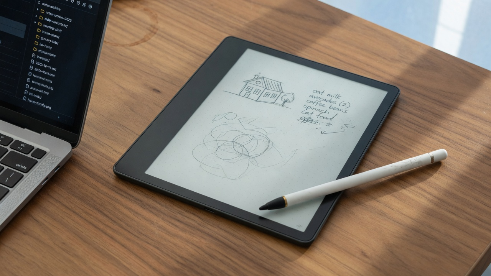
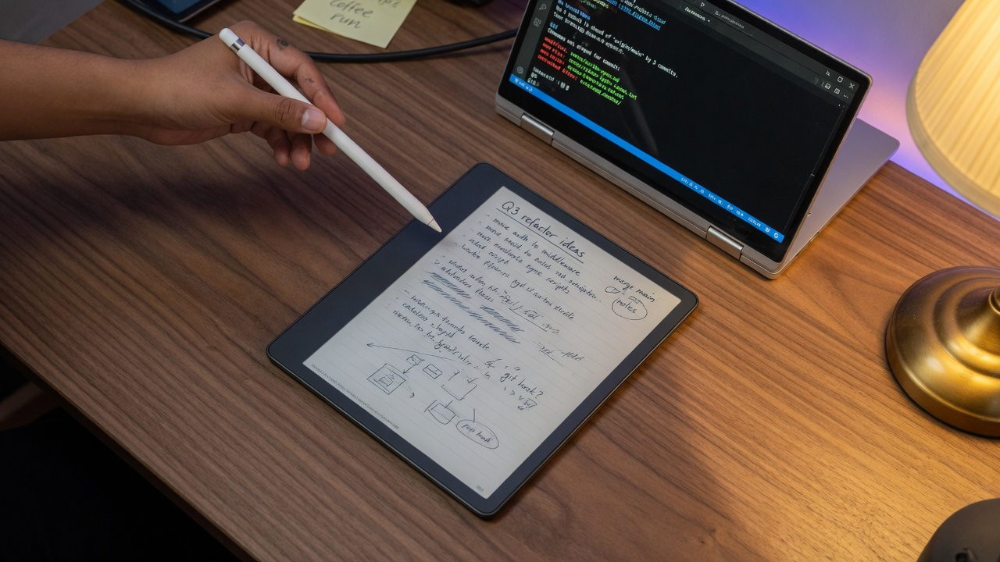

<p align="center">
  
</p>

<h1 align="center">kindle-notes-sync</h1>

<p align="center">
  <b>Write on the Scribe. Keep the notebooks in git you own.</b>
</p>

<p align="center">
  Kindle Scribe · notebooks · folders · GitHub from the device<br>
  firmware 5.19.5 · <code>kindlehf</code> · no computer left running
</p>

<p align="center">
  <a href="https://github.com/lancekrogers/kindle-notes-sync/blob/main/LICENSE"></a>
  <a href="https://github.com/lancekrogers/kindle-userspace"></a>
  
  
</p>

<p align="center">
  <a href="docs/guide.md">Guide</a> ·
  <a href="docs/faq.md">FAQ</a> ·
  <a href="https://github.com/lancekrogers/kindle-userspace">kindle-userspace</a> ·
  <a href="https://github.com/lancekrogers">@lancekrogers</a> ·
  <a href="LICENSE">MIT</a>
</p>

Amazon will email you a PDF if you ask nicely. This repo does the thing people actually want: **export Kindle Scribe notebooks and folders to GitHub from the Scribe itself.**

Close the notebook. Tap **Notes Sync**. Wi-Fi on. The Kindle commits `/mnt/us/notes` and `git push`es. Your computer is optional until you `git pull`.

Pairs with [**kindle-userspace**](https://github.com/lancekrogers/kindle-userspace) (SSH, musl git, vim on the same device). Same author, same Scribe, same stance: you bought the hardware.

## The loop

<p align="center">
  
</p>

| On the Scribe | On GitHub |
|---|---|
| Stock Notebook tab, your folders, your ink | `notebooks/Work/…`, `notebooks/Sketches/…` |
| Close the notebook (Amazon autosaves) | Cover PNG + raw `.nbk` + `INDEX.md` |
| Tap **Notes Sync** | `git pull` whenever you want the files |

No USB cable. **Start SSH** is not part of this. Push goes out over `dbclient`.

## Why this exists

Kindle Scribe notebooks live in a hidden `.notebooks` tree and a library DB Amazon does not document. USB file managers do not show the folder tab. WhisperSync copies ink to Amazon, not to a repo you control.

`notes-sync` reads `/var/local/ksdk.content.db` for titles and folders, copies every `.nbk` that is actually on disk, and pushes to a **private** remote with a write deploy key.

## Works on

- First-gen Kindle Scribe, firmware **5.19.5** (the unit this was written against)
- After a public jailbreak (Véra covers 5.17.1–5.19.6)
- [kindle-userspace](https://github.com/lancekrogers/kindle-userspace) git + [USBNetLite](https://github.com/notmarek/kindle-usbnetlite) khf (`dbclient`)
- A **private** git remote. Do not point a write key at a public notes repo.

**Not a jailbreak.** Bring your own Véra. No hotfix books, no firmware dumps, no DRM tools.

## Install

```bash
# device already has start-ssh + musl git from kindle-userspace
just push kindle                 # scp + install the scriptlet
just setup-remote                # dropbear deploy key; add the pubkey (write) on GitHub

ssh kindle 'cd /mnt/us/notes && git init && git remote add origin git@github.com:YOU/PRIVATE-NOTES.git'
ssh kindle sh /mnt/us/bin/notes-sync selfcheck
```

Then: write → close → tap **Notes Sync** → `git pull`.

```sh
notes-sync            # export + commit + push
notes-sync export     # write notebooks/ only
notes-sync push
notes-sync selfcheck
```

Full pipe, key conversion, FAT gotchas: [guide](docs/guide.md).

## What it will not do

| Limit | Why |
|---|---|
| No auto-push on stroke | There is no watcher. You tap **Notes Sync**. |
| `MISSING` in `INDEX.md` | Title is in Amazon's library DB; the `.nbk` is still in their cloud. Open that notebook once. |
| `.nbk` is Amazon's | Stock `sqlite3` will not open it. Covers are PNG. Render to PDF on a computer if you want. |
| Amazon still boots | This is userspace. We copy files. We do not replace the Notebook app. |

## More Kindle tools

| Repo | What |
|---|---|
| [kindle-userspace](https://github.com/lancekrogers/kindle-userspace) | Wi-Fi SSH, git 2.47, vim 9.1 on `/mnt/us` after Véra |
| [kindle-notes-sync](https://github.com/lancekrogers/kindle-notes-sync) | This. Scribe notebooks → git from the device |

Other work: [github.com/lancekrogers](https://github.com/lancekrogers)

## Docs

| | |
|--|--|
| [Guide](docs/guide.md) | Mechanism, reinstall, dropbear keys, scriptlets |
| [FAQ](docs/faq.md) | Missing notebooks, Start SSH vs GitHub, PDF |
| [SECURITY](SECURITY.md) | No keys, no notebooks, no lab dumps in this tree |

## License

MIT
